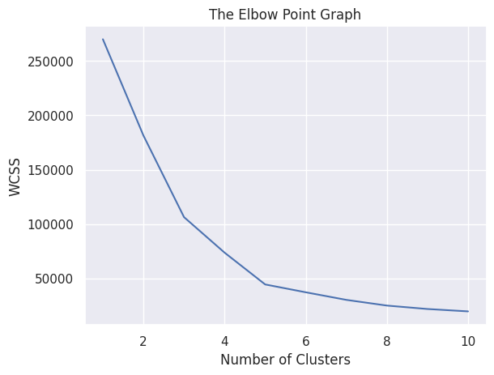
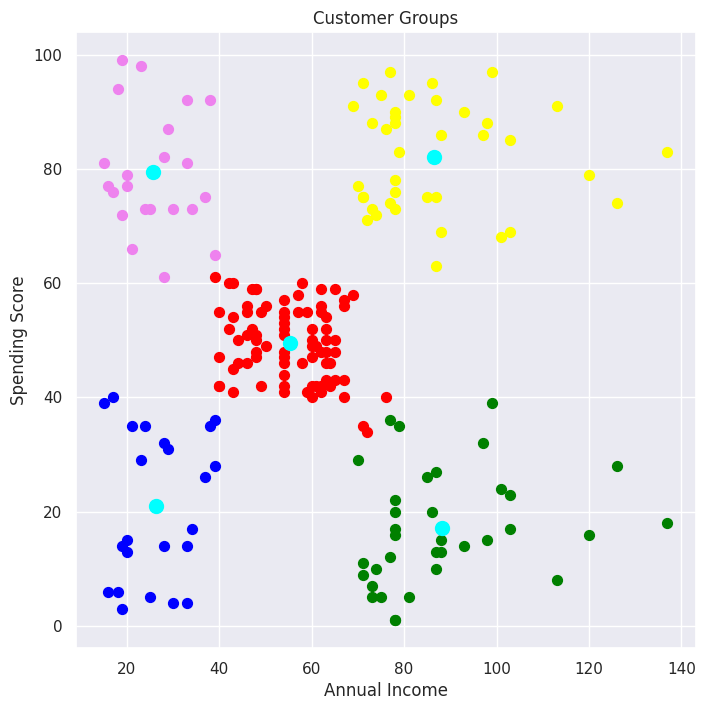

<h1 align="center">Customer Segmentation using K-Means Clustering</h1>

This repository contains the code and data for performing customer segmentation using K-Means clustering. Customer segmentation is a crucial marketing activity that allows businesses to understand their customers better and target them more effectively.

<h2>Table of Contents</h2>
<ul>
    <li><a href="#introduction">Introduction</a></li>
    <li><a href="#dataset">Dataset</a></li>
    <li><a href="#installation">Installation</a></li>
    <li><a href="#project-structure">Project Structure</a></li>
    <li><a href="#key-results">Key Results</a></li>
    <li><a href="#future-work">Future Work</a></li>
    <li><a href="#contributing">Contributing</a></li>
    <li><a href="#license">License</a></li>
    <li><a href="#conclusion">Conclusion</a></li>
</ul>

<h2 id="introduction">Introduction</h2>

Customer segmentation is the process of dividing customers into groups based on common characteristics so that businesses can market to each group effectively and appropriately. In this project, we use K-Means clustering to segment customers based on their annual income and spending score.

<h2 id="dataset">Dataset</h2>

The dataset used in this project is a hypothetical customer dataset available on Kaggle. You can download it from the following link:

<a href="https://www.kaggle.com/datasets/vjchoudhary7/customer-segmentation-tutorial-in-python" target="_blank">Customer Segmentation Dataset</a>

The dataset contains the following columns:

<ul>
    <li><code>CustomerID</code>: Unique ID assigned to the customer</li>
    <li><code>Gender</code>: Gender of the customer</li>
    <li><code>Age</code>: Age of the customer</li>
    <li><code>Annual Income (k$)</code>: Annual income of the customer in thousand dollars</li>
    <li><code>Spending Score (1-100)</code>: Spending score assigned to the customer based on their behavior and spending nature</li>
</ul>

<h2 id="installation">Installation</h2>

To run this project, you will need to install the following dependencies:

<ul>
    <li>Python 3.x</li>
    <li>NumPy</li>
    <li>Pandas</li>
    <li>Matplotlib</li>
    <li>Seaborn</li>
    <li>scikit-learn</li>
</ul>

You can install the required packages using <code>pip</code>:

<pre><code>pip install numpy pandas matplotlib seaborn scikit-learn</code></pre>

<h2 id="project-structure">Project Structure</h2>

The repository is organized as follows:

<pre><code>customer-segmentation-kmeans/
│
├── data/
│   └── Mall_Customers.csv     # Dataset file
│
├── notebooks/
│   └── customer_segmentation.ipynb    # Jupyter notebook with the analysis
│
├── src/
│   └── clustering.py          # Python script for running the clustering
│
├── results/
│   └── elbow_method.png       # Plot of the elbow method
│   └── clusters.png           # Plot of the clusters
│
├── LICENSE
└── README.md
</code></pre>

<h3>Cloning the Repository</h3>

To get started with this project, clone the repository using the following command:

<pre><code>git clone https://github.com/safwannasir49/Customer-segmentation-using-K-Means-Clustering.git
cd Customer-segmentation-using-K-Means-Clustering
</code></pre>

<h2 id="key-results">Key Results</h2>

After running the K-Means clustering algorithm, the customers are divided into five distinct groups based on their annual income and spending score. The key results include:

<h3>Elbow Method Plot</h3>

This plot helps determine the optimal number of clusters. The "elbow" point indicates the best number of clusters, balancing compactness and simplicity.

<h3>Cluster Visualization</h3>

This scatter plot visualizes the customer segments, with each cluster represented by a different color and the centroids marked.

<h2 id="future-work">Future Work</h2>

Future enhancements to this project could include:

<ul>
    <li><strong>Additional Features</strong>: Incorporate more features from the dataset, such as <code>Age</code> and <code>Gender</code>, to improve the segmentation.</li>
    <li><strong>Advanced Clustering Techniques</strong>: Experiment with other clustering algorithms like DBSCAN or hierarchical clustering to compare results.</li>
    <li><strong>Automated Reporting</strong>: Generate automated reports summarizing the characteristics of each customer segment.</li>
    <li><strong>Interactive Visualization</strong>: Use interactive visualization tools (e.g., Plotly) to allow dynamic exploration of the clusters.</li>
</ul>

<h2 id="contributing">Contributing</h2>

Contributions are welcome! Please open an issue or submit a pull request for any improvements or suggestions.

<h2 id="license">License</h2>

This project is licensed under the MIT License - see the <a href="LICENSE">LICENSE</a> file for details.

<h2 id="conclusion">Conclusion</h2>

This project demonstrates the application of K-Means clustering for customer segmentation, which can be a powerful tool for businesses to better understand their customer base. By identifying distinct groups of customers, businesses can tailor their marketing strategies to target specific segments more effectively. The results indicate that using annual income and spending score as features can provide meaningful insights into customer behavior. Future work can expand on these results by incorporating additional features and exploring other clustering techniques.

  
<h3 align="center">Connect with me:</h3>

       
    
    
    

</body>
</html>
